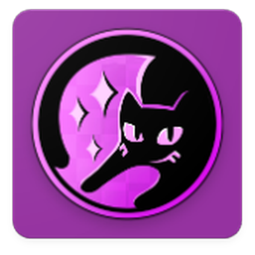

<p align="center">
  
</p>

<p align="center">
  
  
  
  
</p>

<p align="center">
  <a href="https://poppingmangosources.github.io/myaidokusources/">
    
  </a>
</p>

<p align="center">
  On iPhone or iPad, tap the button and add the source list from the page that opens.<br/>
  To add it by hand, open Aidoku, go to <b>Settings → Source Lists</b>, and paste:
</p>

<p align="center">
  <code>https://poppingmangosources.github.io/myaidokusources/index.min.json</code>
</p>

---

## Please read first

**This is a side project, not a maintained source list.**

These are Aidoku clones of my [Paperback sources](https://github.com/PoppingMangoSources/general-extensions-mangago). I built them for one reason: so I could read the sources that weren't already available on Aidoku. They're public in case they're useful to someone else too.

- **The Paperback repository is the main one.** That's where the work happens, where sources get fixed first, and where the full catalog lives.
- **These are not maintained 24/7.** When a site changes its layout or API, the Aidoku version may stay broken for a while — or indefinitely.
- **Sources already on other Aidoku repos aren't duplicated here.** If something I have on Paperback already exists in another Aidoku source list, use that one — it'll be better maintained than mine.

If you want the complete, actively maintained set, use the Paperback repository.

## Sources

**18 sources** — 14 manga, manhwa & manhua, and 4 novels.

### Manga, Manhwa & Manhua

| Source                                                                              | Site                                         |
| :---------------------------------------------------------------------------------- | :------------------------------------------- |
|  **AllManga**         | [allmanga.to](https://allmanga.to)           |
|  **BunManga**         | [bunmanga.com](https://bunmanga.com)         |
|  **Chikari**           | [chikari.moe](https://chikari.moe)           |
|  **Galaxy Manga**  | [galaxymanga.io](https://galaxymanga.io)     |
|  **KaliScan**         | [kaliscan.io](https://kaliscan.io)           |
|  **KingOfShojo**   | [kingofshojo.com](https://kingofshojo.com)   |
|  **LikeManga**       | [likemanga.ink](https://likemanga.ink)       |
|  **MangaTown**       | [mangatown.com](https://www.mangatown.com)   |
|  **oManga**             | [omanga.to](https://omanga.to)               |
|  **RinkoComics**   | [rinkocomics.com](https://rinkocomics.com)   |
|  **RokariComics** | [rokaricomics.com](https://rokaricomics.com) |
|  **Scans.GG**          | [scans.gg](https://scans.gg)                 |
|  **Temple Scan**    | [templetoons.com](https://templetoons.com)   |
|  **VyManga**           | [vymanga.com](https://vymanga.com)           |

### Novels

| Source                                                                              | Site                                       |
| :---------------------------------------------------------------------------------- | :----------------------------------------- |
|  **MVLEMPYR**         | [mvlempyr.io](https://www.mvlempyr.io)     |
|  **NovelArchive** | [novelarchive.cc](https://novelarchive.cc) |
|  **NovelCool**       | [novelcool.com](https://www.novelcool.com) |
|  **ValirScans**     | [valirscans.org](https://valirscans.org)   |

ValirScans carries both comics and novels, so it is listed once here.

## Support

<p align="center">
  <a href="https://discord.com/invite/inkdex">
    
  </a>
</p>

Source problems are handled in the **OTHER-REPOS** channel of the linked Discord. Include the affected source, the title or page that failed, and a screenshot when you can.

Keep the note above in mind: Paperback fixes come first, and an Aidoku source may stay broken for a while.

## Building

Each source is a standalone Rust crate that compiles to WebAssembly.

```sh
cargo install --git https://github.com/Aidoku/aidoku-rs aidoku-cli
cd sources/en.allmanga
aidoku package
```

Pushing to `main` rebuilds every source and publishes the list to GitHub Pages.

## License

This repo is licensed under either of Apache License, version 2.0 or MIT license at your option.

These extensions are not affiliated with Aidoku, Paperback, or any supported website. All site names and logos belong to their respective owners.
